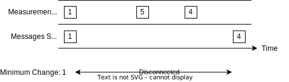
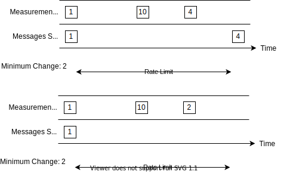

# Status Messages

Status messages are used to convey non-aggregated information about a vehicle's current state (e.g. ambient temperature
or state of charge).

The following status messages are defined within the protocol:

* [VehicleACChargeCurrent](#vehicleacchargecurrent)
* [VehicleACChargeVoltage](#vehicleacchargevoltage)
* [VehicleACCurrentRealized](#vehicleaccurrentrealized)
* [VehicleAmbientTemperature](#vehicleambienttemperature)
* [VehicleBatteryTemperature](#vehiclebatterytemperature)
* [VehicleCabinTemperature](#vehiclecabintemperature)
* [VehicleChargePlugStatus](#vehiclechargeplugstatus)
* [VehicleChargingDCPowerMax](#vehiclechargingdcpowermax)
* [VehicleDCChargeCurrent](#vehicledcchargecurrent)
* [VehicleDCChargeVoltage](#vehicledcchargevoltage)
* [VehicleIgnitionStatus](#vehicleignitionstatus)
* [VehicleOdometer](#vehicleodometer)
* [VehicleOnlineStatus](#vehicleonlinestatus)
* [VehiclePositionStatus](#vehiclepositionstatus)
* [VehiclePreconditioningStatus](#vehiclepreconditioningstatus)
* [VehicleStateOfCharge](#vehiclestateofcharge)
* [VehicleVINStatus](#vehiclevinstatus)

## General Behavior

For specifications of the generic message parameters shared with other message types, see the following sections.

### Reconnection

During times when no connection to the mqtt-broker is possible the vehicle is expected to keep track of the most recent
value for each status message.
When reconnected to the broker, the vehicle is expected to transmit the most recent value if it has changed (beyond the
threshold to trigger a transmission), while still adhering to the rate limits.
No other measurements, except for the most recent, shall be transmitted after reconnecting.
If the previous value is no longer available within the control unit, the most recent measurement must be transmitted
while still adhering to the rate limits.



### On Change Triggering

**All** messages shall be sent as soon as possible on change of one or more of their relevant fields.
A minimum change necessary to trigger a transmission is specified for each numeric field of a message.
Non-numeric fields such as boolean, enumeration or string based fields should trigger a retransmission as soon as their
value changes.
Rate limits **must** still be observed when triggering on change.


```admonish info
Rate limits are omitted in this diagram.
```

### Rate Limit

Each message is supplied with it's individual rate limit.
This describes the minimum time interval which the control unit has to wait before sending another message.
When multiple measurements are taken during a rate limiting interval, only the last one gets transmitted after the rate
limiting interval has expired.

See the following Example:



```admonish info
Values in blocks represent the measurement value.
```

### Timestamp

All status messages share a timestamp field.
The contents of this field are expected to be the time of measurement, **not** the time of sending.

## Messages

In this section all individual status messages are specified in detail.
All status messages use the [Signal](../protobuf-data-types.md#signal) proto3 message as a wrapper, however each defines
it's own subtype within the value field of the signal message.

### VehicleACChargeCurrent

This message is used to transmit the current flow on the vehicle's AC side.

#### Message Parameters

| Value Subtype   | Minimum Sending Period | Rate Limit | MQTT Topic                                                       |
| --------------- | ---------------------- | :--------: | ---------------------------------------------------------------- |
| value_per_phase | None                   |    1 s     | `<manufacturerId>/vehicleStatus/<boxId>/vehicle/acChargeCurrent` |

#### Message Fields

|       Field Name       | proto3 Type    | Unit  | Minimum Value | Maximum Value | Scaling Factor | Minimum change to Trigger *On Change* transmission |
| :--------------------: | -------------- | :---: | :-----------: | :-----------: | :------------: | :------------------------------------------------: |
| value_per_phase.phase1 | optional int32 |   A   |     None      |     None      |      100       |                       0.25 A                       |
| value_per_phase.phase2 | optional int32 |   A   |     None      |     None      |      100       |                       0.25 A                       |
| value_per_phase.phase3 | optional int32 |   A   |     None      |     None      |      100       |                       0.25 A                       |

Value of the AC current flowing to and from the vehicles AC grid connection on the respective phase.
A positive number represents current flowing into the vehicle.
If the vehicle supports power to grid, a negative value is used when the vehicle is providing current to the grid.
As all fields are optional, phases not present in a specific vehicle shall not be transmitted.
However if a vehicle is plugged into a socket with less phases than the vehicle actually supports, 0 values shall be transmitted.

### VehicleACChargeVoltage

This message is used to transmit the voltage present on the vehicle's AC side.

#### Message Parameters

| Value Subtype   | Minimum Sending Period | Rate Limit | MQTT Topic                                                       |
| --------------- | ---------------------- | :--------: | ---------------------------------------------------------------- |
| value_per_phase | None                   |    1 s     | `<manufacturerId>/vehicleStatus/<boxId>/vehicle/acChargeVoltage` |

#### Message Fields

|       Field Name       | proto3 Type    | Unit  | Minimum Value | Maximum Value | Scaling Factor | Minimum change to Trigger *On Change* transmission |
| :--------------------: | -------------- | :---: | :-----------: | :-----------: | :------------: | :------------------------------------------------: |
| value_per_phase.phase1 | optional int32 |   V   |       0       |     None      |       10       |                        5 V                         |
| value_per_phase.phase2 | optional int32 |   V   |       0       |     None      |       10       |                        5 V                         |
| value_per_phase.phase3 | optional int32 |   V   |       0       |     None      |       10       |                        5 V                         |

AC voltage as measured at the vehicle's charge plug.
Negative voltages are not supported.
As all fields are optional, phases not present in a specific vehicle shall not be transmitted.
However, if a vehicle is plugged into a socket with less phases than the vehicle actually supports, 0 values shall be transmitted.

### VehicleACCurrentRealized

This message is used to transmit the charge power currently realized by the vehicle.
The value transmitted here is not including any derating but is referring to the value set in the respective command message.

#### Message Parameters

| Value Subtype     | Minimum Sending Period | Rate Limit | MQTT Topic                                                             |
| ----------------- | ---------------------- | :--------: | ---------------------------------------------------------------------- |
| ACCurrentRealized | None                   |     1m     | `<manufacturerId>/vehicleStatus/<boxId>/vehicle/chargingPowerRealized` |

#### Message Fields

|     Field Name      | proto3 Type            |
| :-----------------: | ---------------------- |
| realized_ac_current | [sts.v2.ValuePerPhase] |
|        type         | enum PowerSettingType  |
|       rpc_Id        | optional bytes         |
|      slice_id       | optional uint32        |

##### Field Description: realized_ac_current

This field describes the current limitations currently applied by the vehicle.
This is referring to a maximum AC current as specified in the corresponding control message without regard to any derating.

See [Current Limitations](./control/README.md#current-limitations)

##### Field Description: type

The type of the ChargingPower is set to the origin command type used to set it.
`POWER_SETTING_INTERNAL` should only be sent when there is no fallback schedule specified
and no other valid charging power or schedule was set or in case of a vehicle internal fault
when executing the current limitations set by the backend.

| Enum Value                           | Description                                                          |
| ------------------------------------ | -------------------------------------------------------------------- |
| POWER_SETTING_TYPE_UNSPECIFIED       | Should never be sent                                                 |
| POWER_SETTING_TYPE_FALLBACK_SCHEDULE | The realized current is based on the currently set fallback schedule |
| POWER_SETTING_TYPE_CHARGING_POWER    | The realized current was set using a `SetChargingPowerRequest`       |
| POWER_SETTING_TYPE_CHARGING_SCHEDULE | The realized current was set using a `SetChargingScheduleRequest`    |
| POWER_SETTING_TYPE_INTERNAL          | The realized current was set to an ECU internal value                |

#### Field Description: rpc_id

This value must be set for all types except `POWER_SETTING_TYPE_UNSPECIFIED` and `POWER_SETTING_TYPE_INTERNAL`.
The value should be set to the identifier of the [RPCRequest](control/README.md#rpcidentifier)
which contained the realized current limitation.

#### Field Description: slice_id

This value must be set for the types `POWER_SETTING_TYPE_FALLBACK_SCHEDULE` and `POWER_SETTING_TYPE_CHARGING_SCHEDULE`.
In case of `POWER_SETTING_TYPE_FALLBACK_SCHEDULE` the value should be set to the identifier of the fallback slice [FallbackPowerSlice](control/charging-schedule.md#field-description-fallback_power_slicesid).
In case of `POWER_SETTING_TYPE_CHARGING_SCHEDULE` the value should be set to the identifier of the power slice [PowerSlice](control/charging-schedule.md#field-description-power_slicesid).

### VehicleAmbientTemperature

This message is used to transmit the temperature of vehicle's outside environment temperature sensor.

#### Message Parameters

| Value Subtype  | Minimum Sending Period | Rate Limit | MQTT Topic                                                          |
| -------------- | ---------------------- | :--------: | ------------------------------------------------------------------- |
| integer_number | None                   |    5 m     | `<manufacturerId>/vehicleStatus/<boxId>/vehicle/ambientTemperature` |

#### Message Fields

|   Field Name   | proto3 Type | Unit  | Minimum Value | Maximum Value | Scaling Factor | Minimum change to Trigger *On Change* transmission |
| :------------: | ----------- | :---: | :-----------: | :-----------: | :------------: | :------------------------------------------------: |
| integer_number | sint64      |  °C   |    -273.2     |     None      |       10       |                        1 °C                        |

##### Field Description: integer_number

This field contains the measurement of the vehicle's ambient temperature sensor.

### VehicleBatteryTemperature

This message is used to transmit the temperature of vehicle's battery pack.

#### Message Parameters

| Value Subtype  | Minimum Sending Period | Rate Limit | MQTT Topic                                                          |
| -------------- | ---------------------- | :--------: | ------------------------------------------------------------------- |
| integer_number | None                   |    1 m     | `<manufacturerId>/vehicleStatus/<boxId>/battery/batteryTemperature` |

#### Message Fields

|   Field Name   | proto3 Type | Unit  | Minimum Value | Maximum Value | Scaling Factor | Minimum change to Trigger *On Change* transmission |
| :------------: | ----------- | :---: | :-----------: | :-----------: | :------------: | :------------------------------------------------: |
| integer_number | sint64      |  °C   |    -273.2     |     None      |       10       |                        1 °C                        |

##### Field Description: integer_number

This field contains the measurement of the vehicle's battery temperature sensor.

```admonish info
If multiple sensors are present, a reasonable aggregation is expected.
```

### VehicleCabinTemperature

This message is used to transmit the temperature of vehicle's driver cabin.

#### Message Parameters

| Value Subtype  | Minimum Sending Period | Rate Limit | MQTT Topic                                                        |
| -------------- | ---------------------- | :--------: | ----------------------------------------------------------------- |
| integer_number | None                   |    1 m     | `<manufacturerId>/vehicleStatus/<boxId>/vehicle/cabinTemperature` |

#### Message Fields

|   Field Name   | proto3 Type | Unit  | Minimum Value | Maximum Value | Scaling Factor | Minimum change to Trigger *On Change* transmission |
| :------------: | ----------- | :---: | :-----------: | :-----------: | :------------: | :------------------------------------------------: |
| integer_number | sint64      |  °C   |    -273.2     |     None      |       10       |                        1 °C                        |

##### Field Description: integer_number

This field contains the measurement of the vehicle's driver cabin temperature sensor.

```admonish info
If multiple sensors are present, a reasonable aggregation is expected.
```

### VehicleChargePlugStatus

This message is used to transmit the state of the vehicle's charge plug/socket.

#### Message Parameters

| Value Subtype      | Minimum Sending Period | Rate Limit | MQTT Topic                                                        |
| ------------------ | ---------------------- | :--------: | ----------------------------------------------------------------- |
| charge_plug_status | None                   |    1 s     | `<manufacturerId>/vehicleStatus/<boxId>/vehicle/chargePlugStatus` |

#### Message Fields

|     Field Name     | proto3 Type           |
| :----------------: | --------------------- |
| charge_plug_status | enum ChargePlugStatus |

##### Field Description: charge_plug_status

| Enum Value                            | Description                                                                                                                            |
| ------------------------------------- | -------------------------------------------------------------------------------------------------------------------------------------- |
| CHARGE_PLUG_STATUS_UNSPECIFIED        | Should never be sent                                                                                                                   |
| CHARGE_PLUG_STATUS_DISCONNECTED       | No plug is connected to the vehicle                                                                                                    |
| CHARGE_PLUG_STATUS_CONNECTED_UNLOCKED | The charge plug is electrically connected but not locked (e.g. vehicle is ready to be unplugged)                                       |
| CHARGE_PLUG_STATUS_CONNECTED_LOCKED   | The charge plug is electrically connected and locked                                                                                   |
| CHARGE_PLUG_STATUS_LOCKING_ERROR      | The charge plug is partially or fully connected but locking was not possible (e.g. locking mechanism frozen, plug not fully pushed in) |

### VehicleChargingDCPowerMax

This message is used to transmit the charge power realizable by the vehicle at the moment.

#### Message Parameters

| Value Subtype      | Minimum Sending Period | Rate Limit | MQTT Topic                                                          |
| ------------------ | ---------------------- | :--------: | ------------------------------------------------------------------- |
| ChargingDcPowerMax | None                   |    1 m     | `<manufacturerId>/vehicleStatus/<boxId>/vehicle/chargingDCPowerMax` |

#### Message Fields

|      Field Name      | proto3 Type | Unit  | Minimum Value | Maximum Value | Scaling Factor | Minimum change to Trigger *On Change* transmission |
| :------------------: | ----------- | :---: | :-----------: | :-----------: | :------------: | :------------------------------------------------: |
|  derating_justified  | uint32      |   W   |       0       |     None      |       1        |                       100 W                        |
| derating_unjustified | uint32      |   W   |       0       |     None      |       1        |                       100 W                        |

##### Field Description: derating_justified

Currently maximum possible charge power achievable by the vehicle, **related to DC-power**.
Only de-rating due ambient temperature and SOC are considered here.
For all other error related de-ratings de-rating_unjustified has to be used.
If no justifiable de-rating exists this should be set to the maximum dc charge power the vehicle can achieve.

##### Field Description: derating_unjustified

Currently maximum possible charge power achievable by the Vehicle.
Related to DC-Power.
Includes all de-ratings, such as de-rating due to overheating or faults in the AC/DC converters.

### VehicleDCChargeCurrent

This message is used to transmit the current flow on the vehicle's DC side.

#### Message Parameters

| Value Subtype  | Minimum Sending Period | Rate Limit | MQTT Topic                                                       |
| -------------- | ---------------------- | :--------: | ---------------------------------------------------------------- |
| integer_number | None                   |    1 s     | `<manufacturerId>/vehicleStatus/<boxId>/vehicle/dcChargeCurrent` |

#### Message Fields

|   Field Name   | proto3 Type | Unit  | Minimum Value | Maximum Value | Scaling Factor | Minimum change to Trigger *On Change* transmission |
| :------------: | ----------- | :---: | :-----------: | :-----------: | :------------: | :------------------------------------------------: |
| integer_number | sint64      |   A   |     None      |     None      |      100       |                       0.25 A                       |

##### Field Description: integer_number

The field contains the measurement of the current flowing into or out of the vehicle measured directly at the AC/DC conversion.
A positive number represents current flowing into the vehicle.
If the vehicle supports power to grid, a negative value is used when the vehicle is providing current to the grid.

### VehicleDCChargeVoltage

This message is used to transmit the voltage present on the vehicle's DC side.

#### Message Parameters

| Value Subtype  | Minimum Sending Period | Rate Limit | MQTT Topic                                                       |
| -------------- | ---------------------- | :--------: | ---------------------------------------------------------------- |
| integer_number | None                   |    1 s     | `<manufacturerId>/vehicleStatus/<boxId>/vehicle/dcChargeVoltage` |

#### Message Fields

|   Field Name   | proto3 Type | Unit  | Minimum Value | Maximum Value | Scaling Factor | Minimum change to Trigger *On Change* transmission |
| :------------: | ----------- | :---: | :-----------: | :-----------: | :------------: | :------------------------------------------------: |
| integer_number | sint64      |   V   |       0       |     None      |      100       |                        5 V                         |

##### Field Description: integer_number

The field contains the measurement of the voltage present directly at the AC/DC conversion.
Negative voltages are not supported.

### VehicleIgnitionStatus

This message is used to transmit the state of the vehicle's ignition.

#### Message Parameters

| Value Subtype   | Minimum Sending Period | Rate Limit | MQTT Topic                                                      |
| --------------- | ---------------------- | :--------: | --------------------------------------------------------------- |
| ignition_status | None                   |    1 s     | `<manufacturerId>/vehicleStatus/<boxId>/vehicle/ignitionStatus` |

#### Message Fields

|   Field Name    | proto3 Type         |
| :-------------: | ------------------- |
| ignition_status | enum IgnitionStatus |

##### Field Description: ignition_status

| Enum Value                  | Description                       |
| --------------------------- | --------------------------------- |
| IGNITION_STATUS_UNSPECIFIED | Should never be sent              |
| IGNITION_STATUS_OFF         | The ignition is off               |
| IGNITION_STATUS_ON          | The ignition is on                |
| IGNITION_STATUS_ACCESSORY   | The ignition is in accessory mode |

### VehicleOdometer

This message is used to transmit the odometer value.

#### Message Parameters

| Value Subtype  | Minimum Sending Period | Rate Limit | MQTT Topic                                                |
| -------------- | ---------------------- | :--------: | --------------------------------------------------------- |
| integer_number | None                   |    1 m     | `<manufacturerId>/vehicleStatus/<boxId>/vehicle/odometer` |

#### Message Fields

|   Field Name   | proto3 Type | Unit  | Minimum Value | Maximum Value | Scaling Factor | Minimum change to Trigger *On Change* transmission |
| :------------: | ----------- | :---: | :-----------: | :-----------: | :------------: | :------------------------------------------------: |
| integer_number | sint64      |  km   |       0       |     None      |       10       |                        1 km                        |

##### Field Description: integer_number

The field contains the total number of kilometers the vehicle has driven, **not** the trip odometer value.

### VehicleOnlineStatus

This message is used to transmit the vehicle's connectivity state to the backend.
This message shall be sent at least every 15 minutes to act as a keep-alive message for the backend.  

```admonish info
When ungracefully terminating the connection (e.g. due to signal loss of the vehicle) to the broker, the broker
itself will inject a [last-will](https://vernemq.com/intro/mqtt-primer/last_will_testament.html) `VehicleOnlineStatus`
message for the specific vehicle with `online_status` set to  `CONNECTIVITY_STATUS_OFFLINE_UNGRACEFUL`  and `timestamp` set
to `0`, therefore marking the vehicle as offline.
```

#### Message Parameters

| Value Subtype | Minimum Sending Period | Rate Limit | MQTT Topic                                                    |
| ------------- | ---------------------- | :--------: | ------------------------------------------------------------- |
| online_status | 15 m                   |    1 s     | `<manufacturerId>/vehicleStatus/<boxId>/vehicle/onlineStatus` |

```admonish warning
This message requires minimum Sending Period of 15 minutes.
The backend expects a message with `online_status` set to `CONNECTIVITY_STATUS_ONLINE` at least every 15 minutes to consider
a vehicle as online.
```

#### Message Fields

|     Field Name      | proto3 Type             |
| :-----------------: | ----------------------- |
| connectivity_status | enum ConnectivityStatus |
|  protocol_version   | string                  |

##### Field Description: online_status

| Enum Value                             | Description                                                                                             |
| -------------------------------------- | ------------------------------------------------------------------------------------------------------- |
| CONNECTIVITY_STATUS_UNSPECIFIED        | Should never be sent                                                                                    |
| CONNECTIVITY_STATUS_ONLINE             | The vehicle has established a connection to the backend and is ready to receive messages                |
| CONNECTIVITY_STATUS_OFFLINE            | The vehicle is terminating it's connection to the backend and is no longer accepting any messages       |
| CONNECTIVITY_STATUS_OFFLINE_UNGRACEFUL | The vehicle has ungracefully lost is's connection to the broker, this value is never set by the vehicle |

##### Field Description: protocol_version

The vehicle's supported protocol version as stated in the release tag of the repository. [Semver-Format](https://semver.org/)
This field is used to determine which version of the protocol the vehicle supports and therefore which messages are available.

### VehiclePositionStatus

This message is used to transmit the vehicle's location.

#### Message Parameters

```admonish info
Some of the parameters of this message are configurable. See [VehiclePositionConfiguration](./control/vehicle-configuration.md).
```

| Value Subtype | Minimum Sending Period                                                 | Rate Limit | MQTT Topic                                                      |
| ------------- | ---------------------------------------------------------------------- | :--------: | --------------------------------------------------------------- |
| position      | See [VehiclePositionConfiguration](./control/vehicle-configuration.md) |    1 m     | `<manufacturerId>/vehicleStatus/<boxId>/vehicle/positionStatus` |

#### Message Fields

|  Field Name  | proto3 Type | Unit  | Minimum Value | Maximum Value | Scaling Factor |           Minimum change to Trigger *On Change* transmission           |
| :----------: | ----------- | :---: | :-----------: | :-----------: | :------------: | :--------------------------------------------------------------------: |
| position.lat | double      |   °   |      -90      |      90       |       1        | See [VehiclePositionConfiguration](./control/vehicle-configuration.md) |
| position.lon | double      |   °   |     -180      |      180      |       1        | See [VehiclePositionConfiguration](./control/vehicle-configuration.md) |

##### Field Description: position.lat

This field contains the latitude part of the GPS position of the vehicle.

##### Field Description: position.lon

This field contains the longitude part of the GPS position of the vehicle.

### VehiclePreconditioningStatus

This message is used to transmit information about the vehicle's preconditioning.

#### Message Parameters

| Value Subtype          | Minimum Sending Period | Rate Limit | MQTT Topic                                                             |
| ---------------------- | ---------------------- | :--------: | ---------------------------------------------------------------------- |
| preconditioning_status | None                   |    1 s     | `<manufacturerId>/vehicleStatus/<boxId>/vehicle/preconditioningStatus` |

#### Message Fields

|                         Field Name                         | proto3 Type                      |
| :--------------------------------------------------------: | -------------------------------- |
| preconditioning_status.preconditioning_schedule_request_id | bytes                            |
|  preconditioning_status.preconditioning_schedule_slice_id  | uint32                           |
|            preconditioning_status.slice_status             | enum  PreconditioningSliceStatus |

##### Field Description: preconditioning_schedule_request_id

This has to match the request id set in the currently active [VehiclePreconditioningSchedule](./control/preconditioning-schedule.md).

##### Field Description: preconditioning_schedule_slice_id

This has to match the slice id of the preconditioning currently being executed as set in the currently active [VehiclePreconditioningSchedule](./control/preconditioning-schedule.md).

##### Field Description: slice_status

| Enum Value                                                        | Description                                                                                                               |
| ----------------------------------------------------------------- | ------------------------------------------------------------------------------------------------------------------------- |
| PRECONDITIONING_SLICE_STATUS_UNSPECIFIED                          | Should never be sent                                                                                                      |
| PRECONDITIONING_SLICE_STATUS_START                                | Vehicle preconditioning for the referenced slice has started                                                              |
| PRECONDITIONING_SLICE_STATUS_END                                  | Vehicle preconditioning for the referenced slice has ended                                                                |
| PRECONDITIONING_SLICE_STATUS_CANCELLED_CUTOFF_SOC                 | Vehicle preconditioning for the referenced slice was not started due to the State of Charge being below the set cutoff    |
| PRECONDITIONING_SLICE_STATUS_CANCELLED_CUTOFF_AMBIENT_TEMPERATURE | Vehicle preconditioning for the referenced slice was not started due to the ambient temperature not fulfilling the cutoff |
| PRECONDITIONING_SLICE_STATUS_CANCELLED_UNPLUGGED                  | Vehicle preconditioning for the referenced slice has ended due to the vehicle being unplugged                             |
| PRECONDITIONING_SLICE_STATUS_CANCELLED_INTERNAL_ERROR             | Vehicle preconditioning for the referenced slice has ended due to a internal fault                                        |

### VehicleStateOfCharge

This message transmits the current state of charge of the vehicle's battery.

#### Message Parameters

| Value Subtype  | Minimum Sending Period | Rate Limit | MQTT Topic                                                     |
| -------------- | ---------------------- | :--------: | -------------------------------------------------------------- |
| integer_number | None                   |    1 m     | `<manufacturerId>/vehicleStatus/<boxId>/battery/stateOfCharge` |

#### Message Fields

|   Field Name   | proto3 Type | Unit  | Minimum Value | Maximum Value | Scaling Factor | Minimum change to Trigger *On Change* transmission |
| :------------: | ----------- | :---: | :-----------: | :-----------: | :------------: | :------------------------------------------------: |
| integer_number | sint64      |   %   |       0       |      100      |       10       |                        1 %                         |

##### Field Description: integer_number

This value represents the percentage up to which the battery is currently charged.

```admonish info
Sending a value of 100% signals to the backend that no further charging is necessary.
When sending this value, all processes which require the vehicle to be connected or charged (e.g. cell balancing)
should be finished.
The vehicle will not receive any charging clearance in subsequent charging plans until its state of charge drops below
100%.
```

### VehicleVINStatus

This message transmits the current VIN of the vehicle the telematic unit is connected to.
Since in some cases telematic units can be switched between vehicles, this message is used to signal that to the backend,
allowing the status messages reported by the telematic unit to be associated with the correct vehicle.

#### Message Parameters

| Value Subtype | Minimum Sending Period | Rate Limit | MQTT Topic                                                 |
| ------------- | ---------------------- | :--------: | ---------------------------------------------------------- |
| text          | 1 d                    |    5 m     | `<manufacturerId>/vehicleStatus/<boxId>/vehicle/vinStatus` |

```admonish warning
This message requires a minimum sending period of *once per day*.
```

#### Message Fields

| Field Name | proto3 Type |
| :--------: | ----------- |
|    text    | string      |

##### Field Description: text

VIN of the vehicle only using all-capital alphanumeric letters as defined in ISO 3779.
